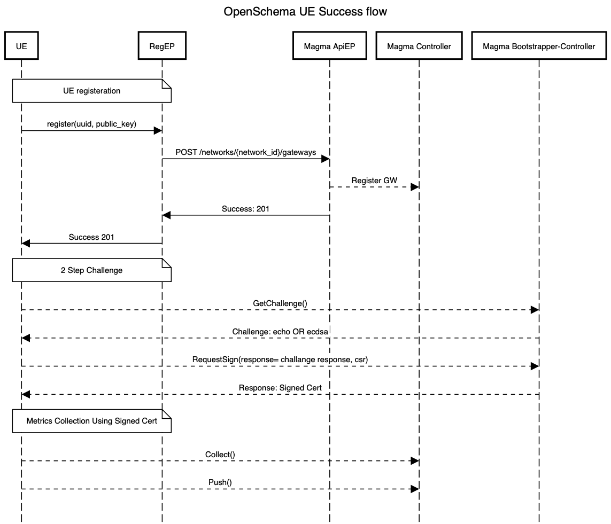

# mma-android
To add openschema MMA library to you project add the following dependency to your build.gradle

```java
dependencies {
	        implementation 'com.github.shoelacewireless:mma-android:-SNAPSHOT'
	}
```
Make sure you have jitpack in you project level build.gradle:

```java
allprojects {
		repositories {
			...
			maven { url 'https://jitpack.io' }
		}
	}
```


## UE BootStrapping flow
Picture below shows the call flow of UE registration and BootStrapping. Please note registration is not implemented yet.


