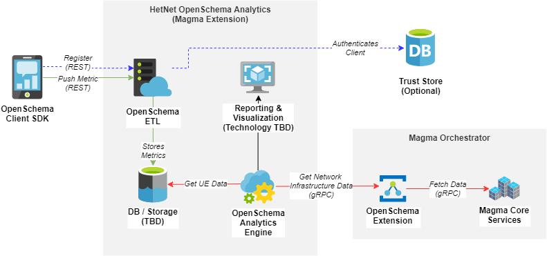

# OpenSchema Root

#### Directories

- openschema-android (client)
- openschema-ios (client)
- openschema-backend (etl)
- openschema-dashboard (reporting & visualization)

## License

OpenSchema is BSD-3 licensed, as found in the LICENSE file.